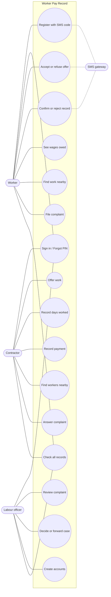
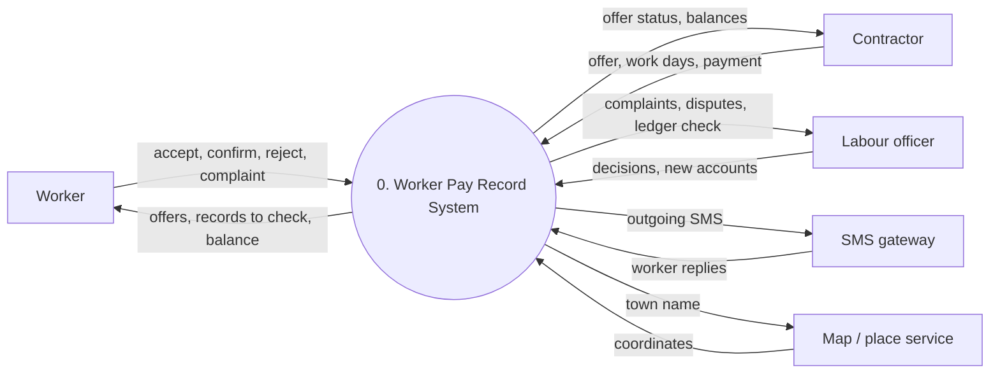
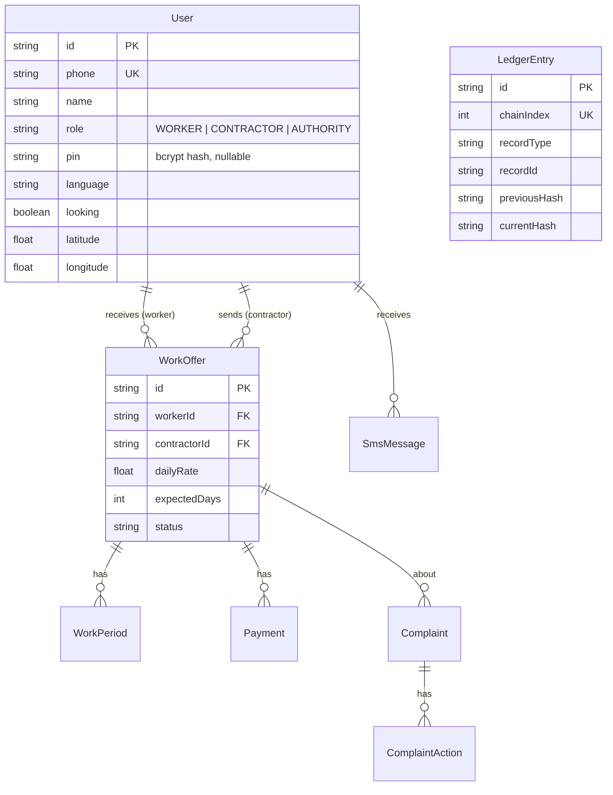
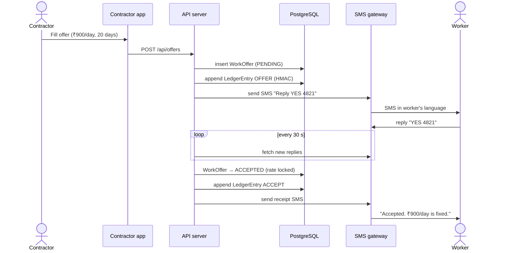

# Brief: design diagrams (Mermaid)

For: Teammate 2. First paste [`system-brief.md`](system-brief.md) into your AI tool, then this file.

## What to make

| # | Diagram | Mermaid type | Notes |
|---|---|---|---|
| 1 | Use case diagram | `flowchart LR` | Mermaid has no real use-case type, so we draw it as a flowchart (see the template) |
| 2 | DFD level 0 (context diagram) | `flowchart LR` | One process, four external entities |
| 3 | DFD level 1 | `flowchart TB` | 6 to 7 processes and the data stores |
| 4 | ER diagram | `erDiagram` | Every table from section 6 of the system brief, with the main fields |
| 5 | Sequence: offer accepted by SMS | `sequenceDiagram` | The most important flow |
| 6 | Sequence: cash payment with handover code | `sequenceDiagram` | Shows why the contractor never sees the code |
| 7 | Sequence: "Check all records" (verify) | `sequenceDiagram` | Shows the hash check |
| 8 | Sequence: nearby search | `sequenceDiagram` | Worker to API to PostGIS |
| 9 | State diagrams: offer, record, complaint | `stateDiagram-v2` | Three small diagrams |
| 10 | System architecture | `flowchart LR` | Apps, API, database, SMS gateway, map service |

Do them in this order. Numbers 1 to 5 are the minimum for the meeting.

## How to check and export

1. Paste the Mermaid code into **https://mermaid.live**. If it shows an error, give the error text to the AI and ask it to fix the code.
2. Export as **PNG** (Actions → PNG) for the slides, and as **SVG** if you want it to stay sharp when zoomed.
3. Save each diagram as a `.md` file in `docs/design/`, with the code inside a ```` ```mermaid ```` block. GitHub draws the diagram when you open the file.

## Rules for correct diagrams

- Use only the actors, tables, fields and routes in the system brief. If the AI adds "Admin", "Email", "Password", "Bank API", "Blockchain" or "Payment gateway", remove them. None of them exist in this system.
- The **worker never types a password.** It is a phone number and a PIN.
- The **officer does not create workers.** Workers register themselves.
- **Nothing is edited or deleted.** A diagram must not show "update rate" or "delete record". A correction is a new record.
- The **Merkle tree** is being built now. You can show it in the verify diagram, but label it "(Phase 2)".
- Keep the labels short: 2 to 5 words on each arrow.

## Templates

These are starting points that are already correct. Give them to the AI and ask it to complete them. Do not ask it to start from nothing.

### 1. Use case diagram



### 2. DFD level 0



### 3. DFD level 1: processes to include

| No. | Process | Reads / writes |
|---|---|---|
| 1.0 | Manage accounts and sign-in | User, PhoneCode |
| 2.0 | Manage offers | WorkOffer, LedgerEntry, SmsMessage |
| 3.0 | Record work and payments | WorkPeriod, Payment, HandoverCode, LedgerEntry |
| 4.0 | Confirm or dispute records | WorkPeriod, Payment, LedgerEntry |
| 5.0 | Handle complaints | Complaint, ComplaintAction, EmployerStatement, DisputeReview |
| 6.0 | Nearby search | User, Place, Town |
| 7.0 | Verify ledger | LedgerEntry + live rows of WorkOffer, WorkPeriod, Payment |

Draw a data store as `D1[(User)]`, `D2[(WorkOffer)]` and so on. The SMS gateway connects to 2.0, 3.0 and 4.0.

### 4. ER diagram (start)



Complete it with every table and the main fields from section 6 of the system brief. **LedgerEntry has no foreign-key line** to WorkOffer, WorkPeriod or Payment. It points to them through `recordType` and `recordId`, so draw that as a dotted note or leave it out.

### 5. Sequence: offer accepted by SMS



### 6. Sequence: payment with a handover code (key points)

- The contractor enters the amount, then `POST /api/payments/code`.
- The server creates a one-time code that is valid for 15 minutes and for that amount only, then **sends it by SMS to the worker only**.
- The API answer to the contractor does **not** contain the code.
- The worker reads the code out, and the contractor types it in: `POST /api/payments/confirm-code`.
- The server checks the code, the amount and the expiry, creates a Payment with `proofType = CODE`, and appends a PAYMENT ledger entry.

### 7. Sequence: verify (key points)

- A user presses "Check all records", which sends `POST /api/ledger/verify`.
- The server loads all LedgerEntry rows in chainIndex order.
- For each row: it loads the **live** record (WorkOffer, WorkPeriod or Payment), rebuilds the payload, computes `HMAC(key, previousHash | payload)` and compares the result with `currentHash`.
- It collects the failures: HASH_MISMATCH, BROKEN_LINK, INDEX_GAP or RECORD_MISSING.
- It returns `{ valid, failures }`. The page shows changed rows in red.

### 8. Sequence: nearby search (key points)

- The worker picks a town (Photon search, or "Use my location" rounded to the nearest town). Then `GET /api/discovery/nearby-work?lat&lng&radiusKm=25`.
- The API sends PostGIS: `ST_DWithin(point, centre, 25000)`, sorted by distance.
- The database returns the contractors and their distances. The API returns `distanceKm` only, with no coordinates.

### 9. State diagrams

- **WorkOffer:** `PENDING → ACCEPTED`, `PENDING → DECLINED`, `PENDING → CANCELLED`. ACCEPTED is final, so there is no way back and the rate cannot change.
- **WorkPeriod / Payment:** `WAITING → CONFIRMED`, `WAITING → DISPUTED`. A DISPUTED record can get one employer statement and one officer review, but it stays DISPUTED.
- **Complaint:** `OPEN → AWAITING_EMPLOYER → OPEN`. It ends in one of `UPHELD`, `REJECTED`, `CLOSED_UNPROVEN`, or `ESCALATED` (to the Labour Commissioner or the Police).

### 10. Architecture (parts to show)

- Browser/phone: **Worker PWA**, **Contractor PWA**, **Officer website**, all served by Vite and React.
- **API server** (Node + Express).
- **PostgreSQL + PostGIS** in Docker.
- **Textbee cloud**, connected to an **Android phone with a SIM**, which sends SMS to the **worker's phone**.
- **Photon** for place search.
- The worker's phone links to the Worker PWA and also receives SMS directly.

## Prompt you can use

> Using the system brief above, complete the Mermaid [diagram name] template below. Use only the actors, tables and routes in the brief. Keep labels short. Return only the Mermaid code.
>
> [paste the template]

Then check the result on mermaid.live against the rules above.
